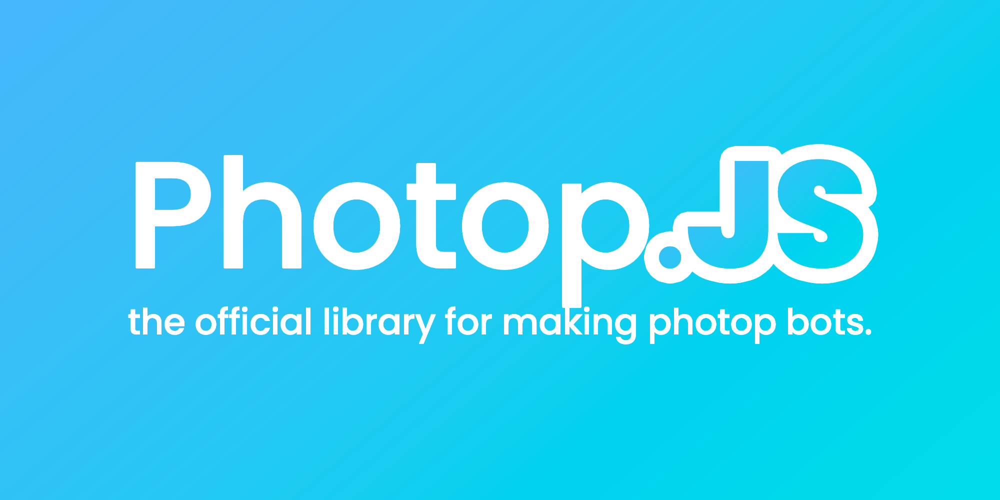

<div allign="center">
    
</div>


# About
Photop.js is a library that allows you to easily interact with Photop's Rest API
<br><br>
# Getting Started

Run this in your command line to install Photop.js

`npm i photop.js`

To login to your bot account

```js
const Photop = require('photop.js');

const client = new Photop.client('token', () => {
   console.log("Ready to go!");
});
```

You can acquire your token by running

`userID + ";" + JSON.parse(localStorage.getItem('token')).token`

In the console on photop.

**!!Be very careful with what you do with your token, if someone bad gets a hand of your token your photop account can be hacked!!**
<br><br>
# Demo

Here is a simple bot that replies to posts that mention it.

```js
const Photop = require('photop.js');

const client = new Photop.client('token', () => {
    client.onMention(post => {
        post.chat('Hello, World!');
    });
});
```

# Credits

Original version of [photopjs](https://www.npmjs.com/package/photopjs) by [IMPixel](https://impixel.tech)
